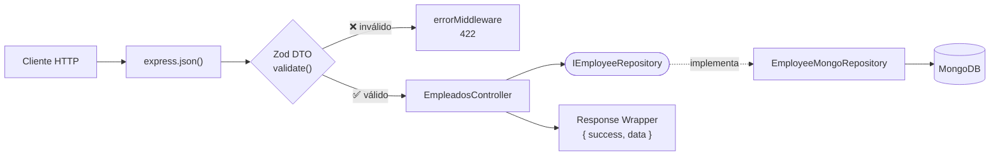

# 🧪 Evaluación de Atributos de Calidad (ISO/IEC 25010) mediante Testing

> **Maestría en Ingeniería de Software** · Universidad Politécnica Salesiana
> **Asignatura:** Patrones de Diseño de APIs · **Docente:** Ing. Patsy Prieto, MSc.
> **Autor:** Christian Naranjo · **Fecha:** 26 de septiembre de 2026


-orange)

---

## 📑 Contenido

1. [Objetivos](#-objetivos)
2. [Arquitectura evaluada](#️-arquitectura-evaluada)
3. [Fase A — Pruebas unitarias aisladas (Jest)](#-fase-a--pruebas-unitarias-aisladas-jest)
4. [Fase B — Pruebas de estrés concurrente (Artillery)](#-fase-b--pruebas-de-estrés-concurrente-artillery)
5. [Hallazgos, causas y mitigaciones](#-hallazgos-causas-y-mitigaciones)
6. [Conclusiones](#-conclusiones)
7. [Plan de acción](#-plan-de-acción)

---

## 🎯 Objetivos

| Objetivo | Atributo ISO/IEC 25010 | Herramienta |
|---|---|---|
| Demostrar el desacoplamiento arquitectónico (Patrón Repository) aislando el controlador HTTP con dobles de prueba | **Mantenibilidad** → Modularidad, Capacidad de ser probado | Jest + ts-jest |
| Evaluar la resiliencia de la barrera contractual (Zod DTO) y la degradación del rendimiento bajo carga concurrente | **Eficiencia de desempeño** → Comportamiento temporal, Utilización de recursos, Capacidad | Artillery |

---

## 🏗️ Arquitectura evaluada



**Refactor aplicado — Inversión de Dependencias (DIP):**

| Antes | Después |
|---|---|
| El controlador hacía `new EmployeeMongoRepository()` internamente → acoplado a Mongoose | `EmpleadosController` recibe `IEmployeeRepository` por **constructor** |
| El router importaba funciones sueltas | `createEmpleadosRouter(controller)` recibe el controlador ya construido |
| No existía un punto central de ensamblaje: cada módulo creaba sus propias dependencias | `index.ts` actúa como **Composition Root**: único punto donde se instancia la implementación concreta |

---

## ✅ Fase A — Pruebas unitarias aisladas (Jest)

### Resultado

```
Test Suites: 3 passed, 3 total
Tests:       14 passed, 14 total
Time:        0.878 s
```

| Suite | Tests | Qué valida |
|---|:---:|---|
| `empleados.controllers.spec.ts` | 10 | CRUD completo, casos 404 y propagación de errores al middleware |
| `validate.middleware.spec.ts` | 2 | Rechazo del payload corrupto y aceptación de uno válido |
| `error.middleware.spec.ts` | 2 | Formato estándar ante `AppError` y ocultamiento de errores internos (500) |

### Cobertura

| Archivo | Stmts | Branch | Funcs | Lines |
|---|:---:|:---:|:---:|:---:|
| `empleados.controllers.ts` | 🟢 100 % | 🟢 100 % | 🟢 100 % | 🟢 100 % |
| `employee.dto.ts` | 🟢 100 % | 🟢 100 % | 🟢 100 % | 🟢 100 % |
| `error.middleware.ts` | 🟢 100 % | 🟢 100 % | 🟢 100 % | 🟢 100 % |
| `validate.middleware.ts` | 🟢 100 % | 🟡 66,66 % | 🟢 100 % | 🟢 100 % |
| `app-error.ts` | 🟢 100 % | 🟡 66,66 % | 🟢 100 % | 🟢 100 % |
| `api-response.ts` | 🟢 100 % | 🟢 100 % | 🟢 100 % | 🟢 100 % |
| **Total** | **100 %** | **88,23 %** | **100 %** | **100 %** |

> ℹ️ Las ramas no cubiertas corresponden a valores por defecto de parámetros (`statusCode = 400` y `target = 'body'`); no afectan la lógica evaluada.

### 🔍 Evidencia de aislamiento

En el reporte de cobertura **no aparece ningún archivo** de `repositories/`, `models/` ni `config/`. Como Jest solo instrumenta los módulos que se cargan durante la ejecución, esto demuestra que **Mongoose nunca se importó** y que no se abrió ninguna conexión a la base de datos.

### ❓ Pregunta de control

> *¿Por qué el uso del patrón de Inversión de Dependencias permite realizar la prueba unitaria del controlador sin necesidad de inicializar un contenedor Docker o instancia de MongoDB local?*

Porque el controlador depende del **contrato** `IEmployeeRepository` y no de una tecnología concreta de persistencia. La implementación real se inyecta desde el *Composition Root*; en la prueba se inyecta un doble (`jest.fn()`) que cumple el mismo contrato y responde en memoria. El controlador nunca ejecuta código de Mongoose ni abre conexiones de red, por lo que la prueba es **rápida** (milisegundos), **determinista** y **aislada de la infraestructura**.

---

## ⚡ Fase B — Pruebas de estrés concurrente (Artillery)

### Configuración (`stress-test.yml`)

| Fase | Duración | Llegada de usuarios | Usuarios virtuales |
|---|:---:|:---:|:---:|
| 1. Calentamiento (tráfico base) | 20 s | 5 /s | 100 |
| 2. Saturación máxima (rampa) | 30 s | 15 → 50 /s | ~975 |
| **Total** | **50 s** | | **1 075** |

**Escenario por usuario virtual** (tráfico mixto 50/50):

| Paso | Petición | Recorrido | Respuesta esperada |
|---|---|---|:---:|
| 🟢 Flujo A | `POST /api/v1/empleados` con datos válidos | Zod → Controlador → Repositorio → MongoDB | `201` |
| ⏸️ `think: 1` | Pausa de 1 s | Simula el tiempo de reflexión de un usuario real | Sin petición |
| 🔴 Flujo B | `POST /api/v1/empleados` con `sueldo: -500` | Rechazo en el middleware Zod | `422` |

**SLA definidos (`ensure`):** `http.response_time.p99 < 200 ms` · `maxErrorRate < 1 %`

### 📊 Resultados globales

| Métrica | Valor | SLA | Estado |
|---|:---:|:---:|:---:|
| `http.codes.201` / `http.codes.422` | 1 075 / 1 075 | Igual al tráfico inyectado | ✅ Coincidencia exacta |
| Peticiones totales | 2 150 | Informativo | 📌 2 por usuario virtual |
| Throughput pico | 90 req/s | Informativo | 📌 Sin degradación |
| Usuarios virtuales fallidos | 0 (0 %) | < 1 % | ✅ Cumple |
| p99 global | 141,2 ms | < 200 ms | ✅ Cumple |
| **p99 solo 2xx (inserciones)** | **219,2 ms** | < 200 ms | ⚠️ **No cumple** |
| Latencia media 2xx vs 4xx | 137,1 ms vs **1,5 ms** | Informativo | 📌 Zod rechaza **~90× más rápido** |

### 📈 Evolución por ventana de medición

| Ventana | Fase | Carga | Peticiones | Mediana 2xx | p99 2xx | Máx | p99 4xx |
|---|---|:---:|:---:|:---:|:---:|:---:|:---:|
| 08:30:30 | Calentamiento | 10 req/s | 67 | 127,8 ms | 🔴 **772,9 ms** | 840 ms | 3 ms |
| 08:30:40 | Calentamiento | 10 req/s | 100 | 127,8 ms | 🟢 144 ms | 152 ms | 4 ms |
| 08:30:50 | Saturación | 40 req/s | 272 | 127,8 ms | 🔴 **788,5 ms** | 827 ms | 6 ms |
| 08:31:00 | Saturación | 60 req/s | 568 | 127,8 ms | 🟢 144 ms | 835 ms | 5 ms |
| 08:31:10 | Saturación | 83 req/s | 812 | 127,8 ms | 🟢 141,2 ms | 849 ms | 5 ms |
| 08:31:20 | Cierre | 90 req/s | 331 | 130,3 ms | 🟢 141,2 ms | 141 ms | 5 ms |

### 🔬 Análisis

**201 vs 422 Exactitud de la barrera perimetral.**
El conteo de rechazos coincide **exactamente** con el tráfico corrupto inyectado: 100 % de payloads inválidos rechazados, sin falsos positivos. El validador responde con `422 Unprocessable Entity` (más preciso que `400`: la petición está bien formada pero viola reglas de negocio). Los ~135 ms de diferencia entre 2xx y 4xx son el viaje a la base de datos que el rechazo temprano **evita**.
→ *ISO 25010: Seguridad / Integridad · Eficiencia de desempeño / Utilización de recursos*

**p99 ¿Crecimiento lineal o exponencial?**
**Ninguno.** Con la carga multiplicada por 9 (10 → 90 req/s), la mediana de las inserciones se mantuvo **constante en ~128 ms**. El costo por petición es fijo y no depende de la carga, por lo que **no hubo encolamiento en el Event Loop**: las escrituras a MongoDB son E/S asíncrona gestionada por el driver y no bloquean el hilo principal.
→ *ISO 25010: Eficiencia de desempeño / Comportamiento temporal y Capacidad*

**Cuellos de botella síncronos potenciales.**
Aunque no se alcanzó la saturación, el pipeline contiene operaciones de CPU que se ejecutan en el hilo del Event Loop: el `JSON.parse` de `express.json()`, el `safeParse` de Zod y el formateo de logs de `morgan`. Con mayor carga, estas operaciones se acumularían, las peticiones se encolarían y el p99 empezaría a crecer de forma **no lineal**.

### 🔁 Comparativa de entornos

| Corrida | Base de datos | Media 2xx | p99 2xx | p99 global |
|---|---|:---:|:---:|:---:|
| 1 | MongoDB local | 4,8 ms | 12,1 ms | 10,1 ms |
| 2 | MongoDB Atlas (remoto) | 137,1 ms | 219,2 ms | 141,2 ms |

> Mismo código, mismo escenario: la diferencia de **~28×** en latencia se explica por el entorno (latencia de red hacia el clúster remoto), no por la aplicación.

---

## 🧭 Hallazgos, causas y mitigaciones

### 🔴 H1 · Credenciales de MongoDB Atlas en el código fuente

| | |
|---|---|
| **Observación** | La URI con usuario y contraseña está en texto plano en `src/config/database.ts`. |
| **Causa** | Configuración hardcodeada, sin variables de entorno. |
| **Mitigación** | Mover la URI a `process.env.MONGO_URI` con `dotenv`, añadir `.env` al `.gitignore` y **rotar la contraseña en Atlas**. Si el archivo ya está en un commit, eliminarlo del código no lo borra del historial de Git. |

```ts
const MONGO_URI = process.env.MONGO_URI;
if (!MONGO_URI) throw new Error('MONGO_URI no está definida');
```

### 🟠 H2 · El SLA solo se cumple en agregado

| | |
|---|---|
| **Observación** | p99 global = 141,2 ms ✅, pero **p99 de 2xx = 219,2 ms** ❌. |
| **Causa** | El 50 % del tráfico son rechazos de ~1,5 ms que bajan el percentil agregado. En producción, donde casi todo el tráfico es válido, el SLA real no se cumpliría. |
| **Mitigación** | Definir umbrales por tipo de respuesta. |

```yaml
ensure:
  thresholds:
    - "http.response_time.p99": 200
    - "http.response_time.2xx.p99": 200   # SLA real de transacciones
    - "http.response_time.4xx.p99": 20    # rechazo perimetral casi inmediato
  maxErrorRate: 1
```

### 🟠 H3 · Arranque en frío (*cold start*)

| | |
|---|---|
| **Observación** | p99 de 2xx = 772,9 ms en la primera ventana; 144 ms en la siguiente. |
| **Causa** | `connectDatabase()` se invoca **sin `await`** y el servidor acepta tráfico antes de tener conexión; Mongoose retiene las operaciones en búfer. Se suman el JIT de V8 sin optimizar y la transpilación en caliente de `tsx`. |
| **Mitigación** | Esperar la conexión antes de escuchar, precalentar el pool y ejecutar JavaScript compilado en producción. |

```ts
await connectDatabase();                 // con { minPoolSize: 10 }
app.listen(port, () => console.log(`Servidor escuchando en el puerto ${port}`));
```

### 🟡 H4 · Latencia fija de ~128 ms por inserción

| | |
|---|---|
| **Observación** | Mediana 2xx constante en 127,8 ms entre 10 y 90 req/s (vs ~3 ms con MongoDB local). |
| **Causa** | Cada inserción hace al menos un viaje de ida y vuelta al clúster remoto de Atlas; ese costo de red consume por sí solo más de la mitad del presupuesto de 200 ms. |
| **Mitigación** | Ejecutar las pruebas de carga contra MongoDB local o en Docker; en producción, desplegar la API en la misma región que el clúster o ajustar el SLA al entorno cloud. |

### 🟡 H5 · Picos intermitentes de ~800 ms

| | |
|---|---|
| **Observación** | Máximos de 827–849 ms a 10, 40, 60 y 83 req/s, en menos del 1 % de las peticiones. |
| **Causa** | Al aparecer con el mismo valor sin importar la carga, **no indican saturación**. Lo probable son pausas de recolección de basura (GC) de V8 o variaciones de latencia de red hacia Atlas. |
| **Mitigación** | Diagnosticar con `node --trace-gc` y el profiler de Atlas; ejecutar una prueba más larga (5–10 min) para detectar periodicidad. |

### 🟡 H6 · La prueba de estrés contamina la base de datos

| | |
|---|---|
| **Observación** | Cada corrida inserta ~1 075 empleados, y `GET /api/v1/empleados` los devuelve todos sin paginar. |
| **Causa** | No existe una base dedicada a pruebas ni paginación en el endpoint. |
| **Mitigación** | Usar una base exclusiva (`usuarios_db_stress`) con limpieza al terminar e implementar `?page=&limit=` en el repositorio y el endpoint. |

### 🔵 H7 · La cobertura del 100 % no es de todo el proyecto

| | |
|---|---|
| **Observación** | El repositorio Mongo, las rutas, `database.ts` e `index.ts` no aparecen en el reporte. |
| **Causa** | Jest solo mide los archivos que los tests importan (lo cual, a la vez, es la evidencia de aislamiento). |
| **Mitigación** | Configurar `collectCoverageFrom: ['src/**/*.ts', '!src/**/*.spec.ts']` y agregar pruebas de integración con `supertest` + `mongodb-memory-server`. |

### 🔵 H8 · Riesgos del Event Loop ante mayor carga

| | |
|---|---|
| **Observación** | Sin degradación hasta 90 req/s, pero el pipeline tiene operaciones síncronas. |
| **Causa** | `JSON.parse`, validación Zod y logging se ejecutan en el único hilo del Event Loop. |
| **Mitigación** | `express.json({ limit: '10kb' })`, logging reducido en producción, *rate limiting* con `express-rate-limit` (respuesta `429` controlada) y escalado horizontal (`pm2 start -i max`). |

### ⚪ H9 · Hallazgos de mantenimiento

| Hallazgo | Mitigación |
|---|---|
| TypeScript 7 no expone la API de compilador que requiere `ts-jest` (y `ts-node`) | ✅ Resuelto: TypeScript fijado en `~5.9`; `jest` importado desde `@jest/globals` (no existe como global en ESM) |
| `src/app.ts` es código muerto (CommonJS en un proyecto ESM, sin referencias) | Eliminar el archivo |

### 📋 Resumen

| # | Hallazgo | Atributo ISO 25010 | Severidad |
|:---:|---|---|:---:|
| H1 | Credenciales en el código fuente | Seguridad / Confidencialidad | 🔴 Crítica |
| H2 | SLA oculto en agregado (p99 2xx = 219 ms) | Comportamiento temporal | 🟠 Alta |
| H3 | Cold start (escucha antes de conectar) | Comportamiento temporal / Disponibilidad | 🟠 Alta |
| H4 | Latencia fija de ~128 ms hacia Atlas | Utilización de recursos | 🟡 Media |
| H5 | Picos intermitentes de ~800 ms | Comportamiento temporal | 🟡 Media |
| H6 | Datos de prueba en la base real, sin paginación | Integridad / Capacidad | 🟡 Media |
| H7 | Cobertura parcial del proyecto | Capacidad de ser probado | 🔵 Baja |
| H8 | Operaciones síncronas en el Event Loop | Capacidad | 🔵 Preventivo |
| H9 | Incompatibilidad de herramientas / código muerto | Mantenibilidad | ⚪ Resuelto / Baja |

---

## 🏁 Conclusiones

1. **Mantenibilidad validada.** La Inversión de Dependencias permitió probar el controlador al 100 % sin base de datos, Docker ni red, con 14 pruebas que se ejecutan en menos de un segundo.
2. **Barrera perimetral eficaz.** Zod rechazó el 100 % del tráfico corrupto (1 075 / 1 075) en ~1,5 ms, unas 90 veces más rápido que una transacción completa, protegiendo la integridad de los datos y los recursos de la base.
3. **Sistema estable, pero no dentro del SLA real.** Hubo 0 % de errores y la latencia no se degradó con la carga, pero las transacciones válidas (p99 = 219,2 ms) exceden los 200 ms por la latencia hacia MongoDB Atlas. El SLA global pasó solo porque los rechazos rápidos bajaron el percentil agregado.
4. **La prioridad inmediata es de seguridad:** sacar las credenciales del código y rotarlas.

---

## 🗺️ Plan de acción

| # | Acción | Hallazgo | Prioridad | Estado |
|:---:|---|:---:|:---:|:---:|
| 1 | Mover las credenciales a `.env` y rotar la contraseña de Atlas | H1 | 🔴 Crítica | ⏳ Pendiente |
| 2 | Añadir umbrales `2xx.p99` y `4xx.p99` en `stress-test.yml` | H2 | 🟠 Alta | ⏳ Pendiente |
| 3 | `await connectDatabase()` antes de `app.listen()` y configurar `minPoolSize` | H3 | 🟠 Alta | ⏳ Pendiente |
| 4 | Repetir la prueba de estrés contra una base local o dedicada, guardando el reporte con `--output` | H4 · H6 | 🟡 Media | ⏳ Pendiente |
| 5 | Implementar paginación y limpiar los datos generados por la prueba | H6 | 🟡 Media | ⏳ Pendiente |
| 6 | Configurar `collectCoverageFrom` y agregar pruebas de integración (`supertest` + `mongodb-memory-server`) | H7 | 🔵 Baja | ⏳ Pendiente |
| 7 | Aplicar `express.json({ limit })`, *rate limiting* y reducir el logging en producción | H8 | 🔵 Preventivo | ⏳ Pendiente |
| 8 | Eliminar `src/app.ts` | H9 | ⚪ Baja | ⏳ Pendiente |

Comando para repetir la prueba guardando el reporte:

```bash
artillery run --output stress-report.json stress-test.yml
```

---

<div align="center">

**Maestría en Ingeniería de Software · UPS · Periodo Septiembre 2026**

</div>